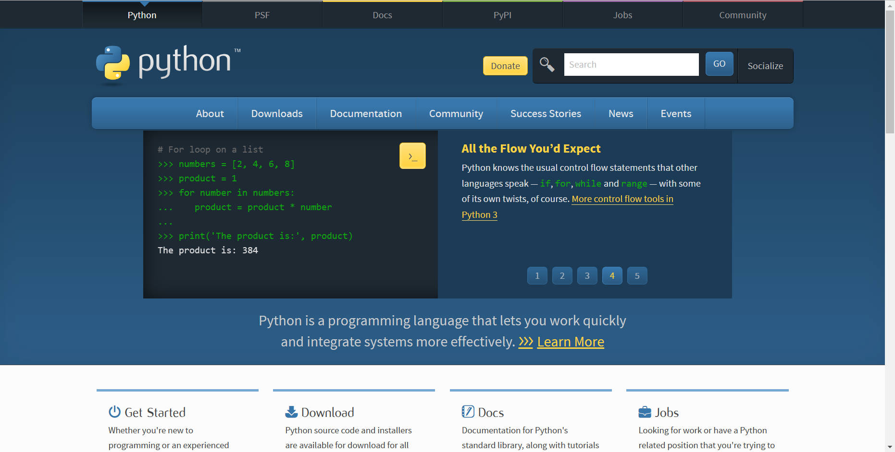
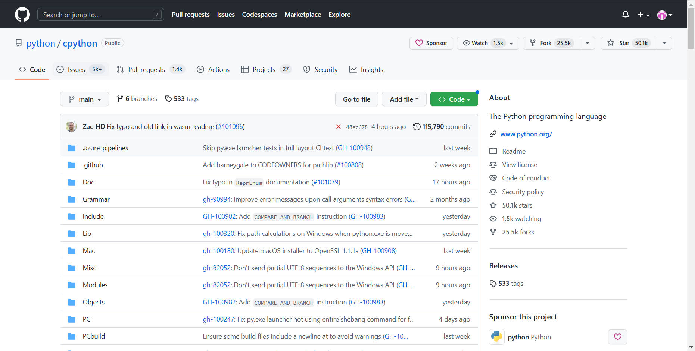
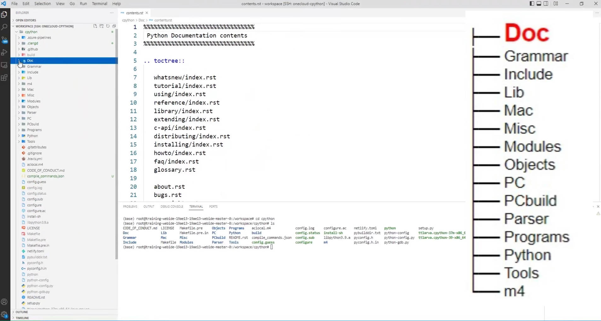
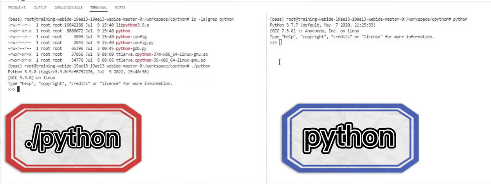

# 认识 [CPython](https://github.com/python/cpython) 源码结构并且编译


:earth_asia: **Bilibili视频传送门：**[认识 CPython 源码结构并且编程](https://www.bilibili.com/video/BV12d4y1D7xM/?share_source=copy_web) :earth_asia:


Python 语言的地位和价值相信已经不需多言，易学、生态丰富和免费等特点，使得它遍布工业和学术界的各个领域。无论是绘图还是科学计算，或者是从爬虫到网站后台，几乎都能见到它的身影。只要使用者想找，就一定能找到用得上的 Python Package。再比如在人工智能领域，例如 OneFlow、PyTorch 和 TensorFlow 这些深度学习框架，都优先使用 Python 作为用户接口语言。

因此，Python 也被称为“当代人工智能语言”！

那么，大家在使用 Python 解决问题的过程中，是否会好奇它是怎么做到的呢？这也是本文想要与大家分享 CPython 源码的原始动力。

什么是 CPython？CPython 和 Python 有什么样的关系呢？接下来就让我们一起来了解一下吧。


## 什么是 CPython

如果你现在所使用的 Python 是直接或者间接从 [python.org](https://www.python.org/) 网站上下载的，那么其实你已经在使用 CPython 了。



CPython 其实是 Python 的一种实现，也是 Python 最官方和最正统的实现。CPython 之所以叫这个名字，是因为它其实是用 C 语言写的 Python 解释器。除了 CPython 之外，还存在其他版本的 Python 实现，比如：

- Jython：用 Java 写的 Python 解释器
- PyPy：用 Python 写的 Python 解释器
- Cython：将 Python 当作静态语言编译

将 CPython 作为研究对象，本系列文章主要会介绍 3 个部分的内容：

- 结合 CPython 源码，介绍调试工具和调试技巧
- 结合 CPython 源码，介绍 C 开发的技巧
- 结合 CPython 解释器，介绍编译原理


## CPython的源码结构

CPython 的仓库地址为 [https://github.com/python/cpython](https://github.com/python/cpython)



我们可以将这个仓库克隆到本地，打开控制台：

```
git clone https://github.com/python/cpython.git
```

下载完成代码后，首先了解了解一下 CPython 的仓库源码结构。



### 1. Doc 目录

**Doc** 目录包含了 Python 官方文档的源码，大部分都是 `rst` 格式。

### 2. Grammar 目录

该目录记录了关于 Python 的语法定义，比如 tokens、grammar 文件，在 CPython 中是有专门的脚本读取这些文件，再去生成词法解析和语法解析的代码的，因此它们也是源码的一部分，随意修改的话可能会造成编译错误。

### 3. Include 目录

**Include** 目录是头文件目录，主要用于存放头文件。

### 4. Lib 目录

**Lib** 目录是 Python 写的标准库。

### 5. Modules 目录

**Modules** 目录是 C 语言写的标准库。

### 6. Mac、PC 和 PCbuild 目录

这些目录与 Mac 和Windows 上的定义有关，对于学习源码而言不是特别重要。

### 7. Misc 目录

顾名思义，该目录为杂项目录，里面主要是一些配置有关的脚本。

### 8. Objects 目录

**Objects** 目录中有 Python 的核心内置类型，与 Python 的对象模型息息相关。在之后谈论到如何用 C 实现面向对象时，会联系它来做讲解。

### 9. Parser 目录

**Parser** 目录里包含了 Python 语言的前端，即词法解析、语法解析等。

### 10. Programs 目录

该目录中包含了 Python 可执行文件的入口和相关实现等。

### 11. Python 目录

**Python** 目录中包含了 Python 解释器的实现。

剩余的其他目录在学习中的作用不是很重要，感兴趣的同学可以查看源码中的说明。


## 编译 CPython

在了解了目录结构之后，我们开始编译 CPython 吧！

编译 CPython 很简单，它只有两步：

- 运行 `configure` 脚本，得到 Makefile 文件
- `make` 开始编译

我们首先在 CPython 的目录下运行 `configure` 脚本

```
./configure CFLAGS="-g -O0"
```
这里的两个编译参数表示编译时带符号以及不做优化，这是为了我们后续调试方便。

如上，我们就配置完成了。接着我们继续敲 `make` 命令进行编译

```
make -j4
```

命令执行之后，我们可以看到提示，虽然有警告说部分库编译不成功，但是根据提示 *Python build finished successfully!* 可知，Python 已经被编译好了。在当前的路径下，我们可以发现多了一个 Python 可执行文件，这就是我们刚刚编译的结果了。

为了让大家确认一下，我们可以运行一下系统自带的 Python，在终端输入

```
python
```

和我们刚刚编译的 Python

```
./python
```



我们可以发现系统上带的 Python 为 3.7 版本的，并且显示是从 Anaconda 上发布的，而我们刚刚编译的 Python 是 3.9 版本的，这里还带了仓库的 Tag Commit 信息。


至此，恭喜大家亲自编译 Python 成功！