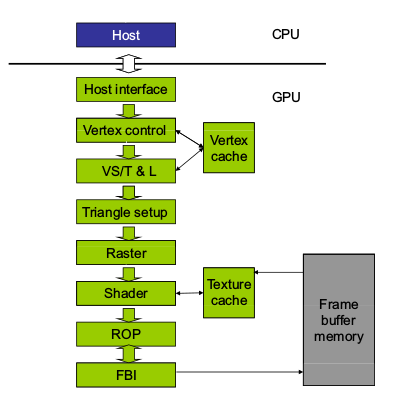
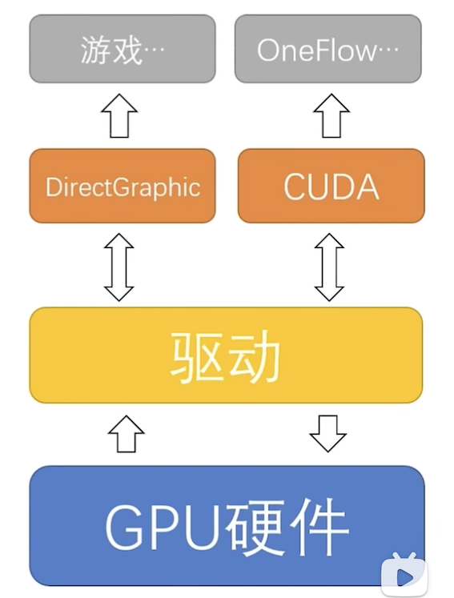
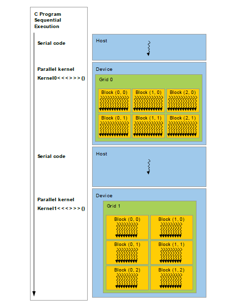

# CUDA 是什么


:earth_asia: **Bilibili视频传送门：**[CUDA编程01：GPU发家史-从游戏到CUDA](https://www.bilibili.com/video/BV1Mb4y1p7BG?share_source=copy_web) :earth_asia:

新手入门 CUDA 必备知识：

- GPU 并行编程的过去和现在

- 编写第一个 CUDA 程序

这篇文章帮大家梳理 GPU 并行编程的过去和现在，以及 CUDA 在其中的作用。

## 1. 早期 GPU 的应用

显卡最初的目的是能更好的处理和生成图片、最后输出到显示器上，主要应用于游戏和 CG 领域。GPU 是显卡中最重要的组成部分，常作为显卡的代称。GPU 和 CPU 的主要特点比较如下：


| **NO.特性** | **CPU**     | **GPU**     |
|:---------:|:-----------:|:-----------:|
| **定义**    | 中央处理器       | 图形处理单元      |
| **内存消耗**  | 需求大         | 需求小         |
| **速度**    | 速度低         | 速度高         |
| **核心数**   | 拥有少量功能强大的核心 | 拥有大量功能稍弱的核心 |
| **适用领域**  | 适用于串行指令处理   | 适合并行指令处理    |
| **重点**    | 关注低延迟       | 强调高吞吐量      |


早期的 GPU ，只有和图像处理有关的 API：





为了将 GPU 应用于图像处理之外的工作，早期的方法是将任务转换成图像处理的形式，再使用原本用于图像渲染、坐标换算的 API 完成通用计算。这种方法的学习成本是非常高的，CUDA 因此应运而生。

## 2. CUDA 的诞生

CUDA：英伟达提出的通用并行计算架构

CUDA 和 DirectGraphic 类似，都是通过调用驱动操纵显卡，不同的是 DirectGraphic 提供的 API 主要是和图形有关，而 CUDA 主要用于支持通用计算。



CUDA 编程的特点：

- 并行编程

例如两个长度为 N 的向量相加：

```C++
void VectorAdd(int n,float *x,float *y)
{
    for(int i=0;i<n;i++){
        y[i] = x[i] +y[i];
    }
}

int main(int argc, char* argv[])
{
    int N = 1<<24; //16,777,216
    float *x = nullptr;
    float *y = nullptr;
    
    //Allocate Unified Memory - accessible from CPU or GPU
    x = (float*)malloc(N*sizeof(float));
    y = (float*)malloc(N*sizeof(float));
    
    VectorAdd(N,x,y);
    return 0;
}
```

对于串行编程，需要循环 N 次，将这两个向量的元素逐一加和；而 CUDA 可以开 N 个线程，同时处理 N 个元素，也就是并行编程。

- 异构编程

平常的代码都是运行在 CPU 上的，当我们想要使用 GPU 的资源时，需要通过特定的语法或函数让 GPU 分配资源、进行计算，以及将结果拷贝回 CPU ，这个过程就是异构编程。



